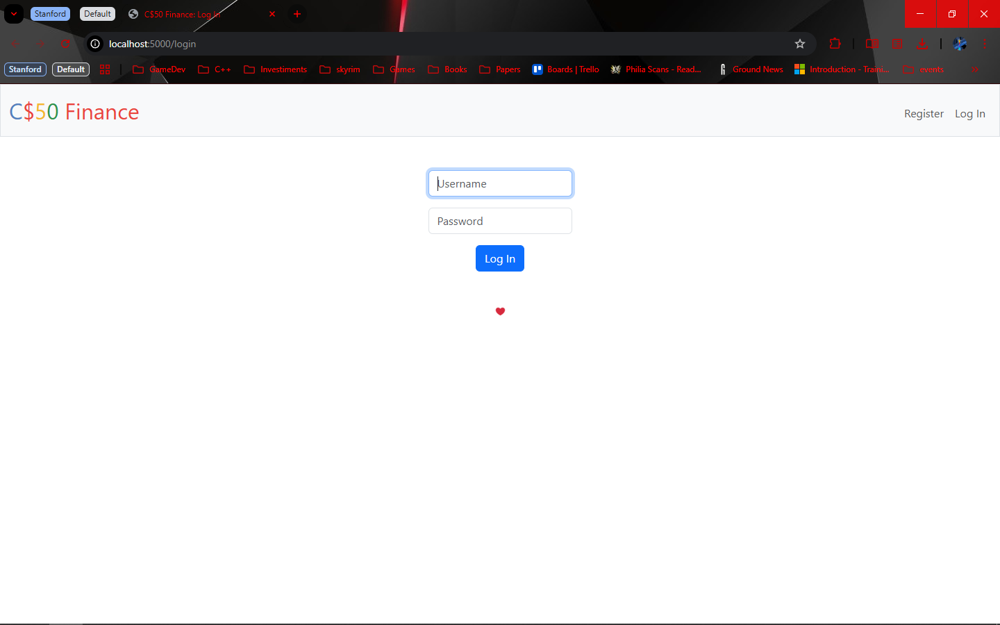
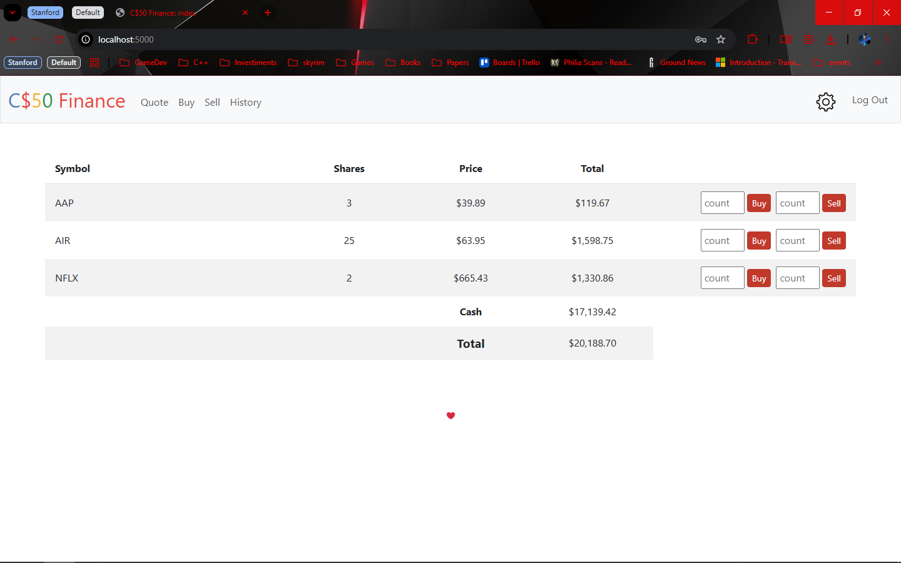

# code50 Programming Projects

A collection of programming projects covering core computer science concepts — algorithms, data structures, web development, and problem-solving — across C, Python, HTML, CSS, and JavaScript.

## Overview

35+ projects that build on each other in complexity. C makes up the bulk of the codebase (64.1%), reflecting a strong focus on systems programming and algorithmic thinking, with Python and web development rounding things out.

---

## Projects

### 🌐 Web Development

#### [finance](./finance)
A stock portfolio web app built with Flask. Supports user registration, simulated stock trading with real price data, and portfolio tracking. Covers authentication, database management, and financial logic.

| Login | Index |
| :---: | :---: |
|  |  |

#### [trivia](./trivia)
A trivia quiz web app with a Flask backend, dynamic front end, and score tracking.

#### [birthdays](./birthdays)
A Flask web app for managing birthday records. Covers form handling, database operations, and basic dynamic content — a solid intro to full-stack web development.

#### [homepage](./homepage)
A personal portfolio site using HTML, CSS, and JavaScript — responsive, styled, and interactive. - In progress

---

### 🗄️ SQL & Databases

#### [fiftyville](./fiftyville)
A SQL-based mystery — you're given a crime scenario and a database, and you work through increasingly complex queries to find the culprit. Genuinely enjoyable.

#### [movies](./movies)
SQL queries on a movie database covering films, directors, ratings, and relationships. Gets into more advanced joins and aggregations.

#### [songs](./songs)
SQL queries on a music database — analyzing songs, artists, and related data.

---

### 🔍 Hash Tables & Dictionaries

#### [speller](./speller)
A spell checker that uses a hash table to load a dictionary and validate words. One of the more performance-focused projects.

#### [dna](./dna)
Identifies individuals based on DNA profiles by counting STR sequences and matching them against a dataset. Involves file I/O, data structures, and search logic.

---

### ⚙️ Algorithms

#### [tideman](./tideman)
Implements ranked-choice voting using graph-based logic to determine an election winner. One of the more algorithmically challenging projects here.

#### [sort](./sort)
Implements and benchmarks sorting algorithms including bubble sort, selection sort, and merge sort. A good reference for understanding time complexity in practice.

#### [filter-less & filter-more](./filter-less)
Image processing in C. Implements filters like grayscale, sepia, blur, and edge detection by directly manipulating pixel data.

#### [recover](./recover)
Recovers deleted JPEG files from raw disk data by scanning for file headers at the byte level. One of the more interesting projects in the collection.

#### [volume](./volume)
Adjusts audio file volume by scaling raw sample values — involves working with binary data and basic signal processing.

#### [plurality](./plurality)
A simple plurality voting system that tallies votes and determines a winner.

#### [credit](./credit)
Validates credit card numbers using the Luhn algorithm. Available in both C and Python.

#### [readability](./readability)
Estimates how difficult a text is to read using the Coleman-Liau index. Involves string parsing and mathematical calculations.

#### [substitution](./substitution)
Encrypts text using a keyword-based substitution cipher. Covers basic cryptography and character manipulation.

#### [seven-day-average](./seven-day-average)
Computes rolling 7-day averages for smoothing out data trends over time.

---

### 🐍 Python Ports

#### [sentimental-credit / sentimental-hello / sentimental-mario-more / sentimental-readability](./sentimental-credit)
Python reimplementations of several C projects — same logic, different language. Useful for seeing how the two compare in practice.

---

### 🔰 Foundational & Introductory

#### [mario](./mario)
Generates Mario-style pyramid patterns from user input. A classic exercise in loops and control flow.

#### [scrabble](./scrabble)
Calculates Scrabble scores for words based on letter values.

#### [inheritance](./inheritance)
Models a family tree to explore how structs, pointers, and hierarchical data work in C.

#### [jar](./jar)
A coin jar simulator demonstrating basic data structure concepts.

#### [MyLib](./MyLib)
A shared utility library used across other projects. Keeps reusable functions in one place instead of duplicating code everywhere.

#### [me](./me)
A personal profile from an introductory assignment.

#### [test](./test)
Test cases and sample data used to validate other projects.

---

## Technologies

| Category | Details |
|----------|---------|
| **Languages** | C (64.1%), Python (19.2%), HTML (12.1%), CSS (3.4%), JavaScript (0.1%) |
| **Frameworks & Tools** | Flask, SQLite |
| **Topics** | Algorithms, data structures, cryptography, web development, file I/O, database design |
